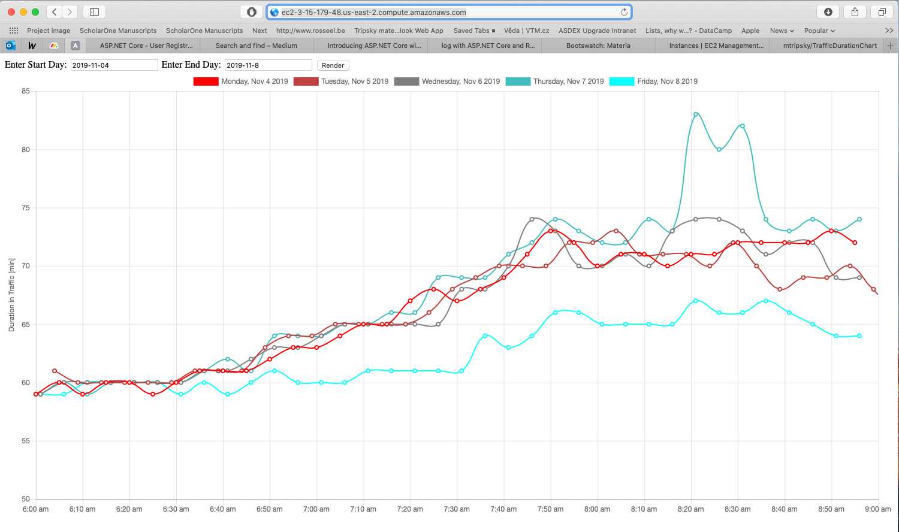

# TrafficDurationChart service

This service is deployed on my AWS cloud [1](http://ec2-3-15-179-48.us-east-2.compute.amazonaws.com). It draws the duration in traffic dependency on time during the day between two addresses. It queries my Mongo database running on MongoDB Atlas cloud. The first entries in the database are from `2019-11-04`.  

The main reason for this service is to predict the best time for me to leave my home to avoid heavy traffic.

